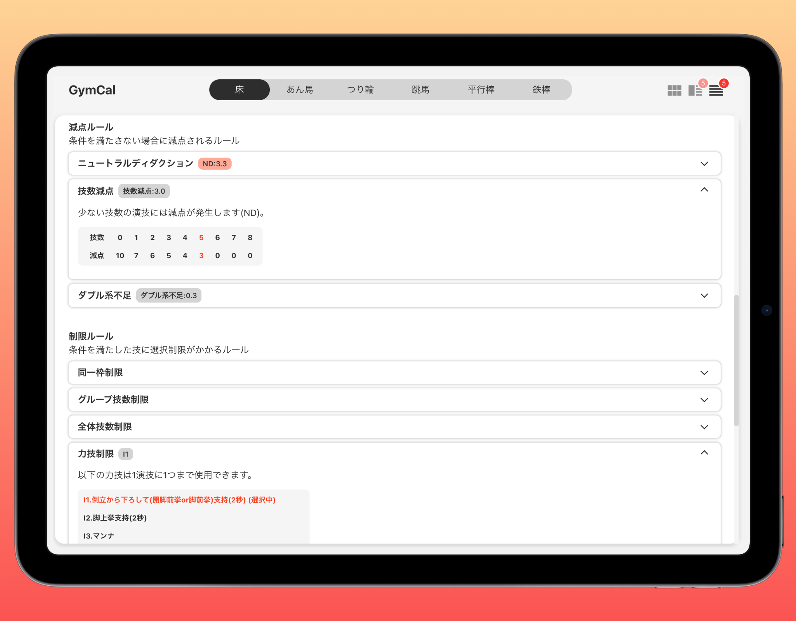
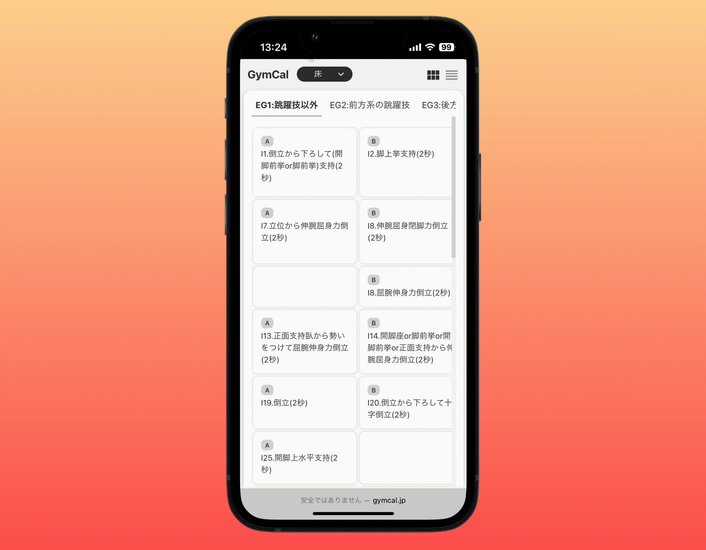
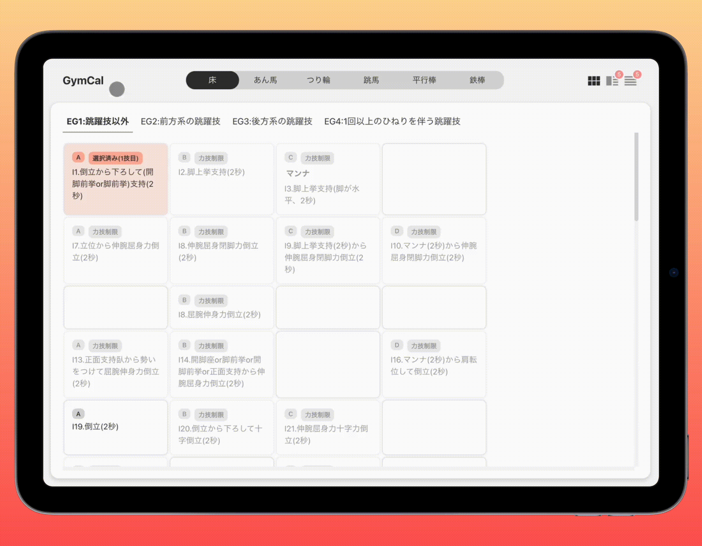
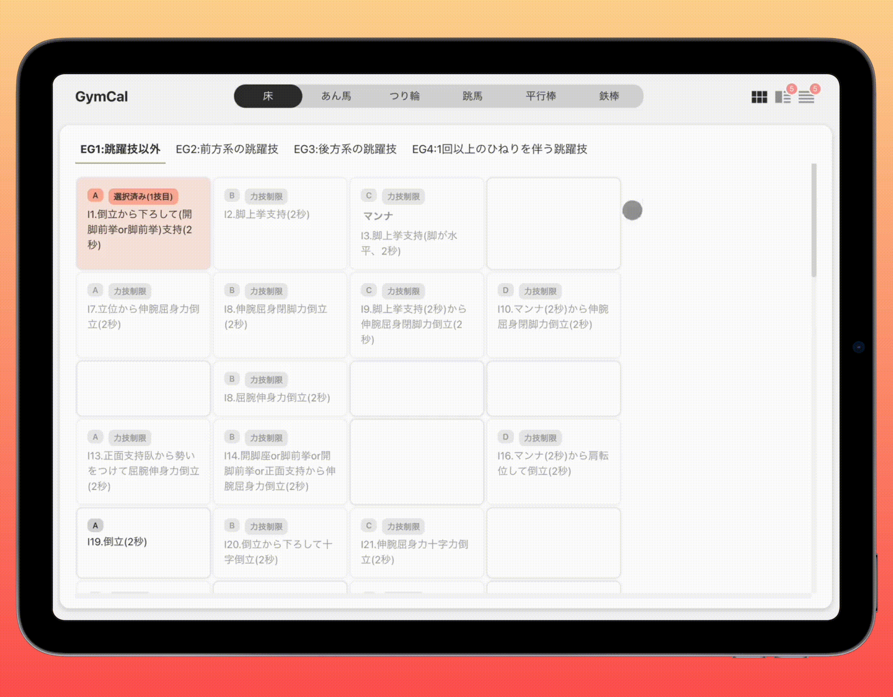

# ■ GymCal

（画像）

## ■ アプリ URL

http://gymcal.jp

ログイン不要で全サービスを利用できます。

## ■ アプリ概要

体操競技のデジタル採点規則アプリ「GymCal」

## ■ アプリを作ったきっかけ

数学の公式を文章で学ぶより、例題を解く方が理解が深まった経験はありませんか？

体操競技の複雑なルールが**「電卓のように自動計算」**されたらもっと直感的に理解できるのではないかと考え、このアプリを開発しました。

体操競技は 4 年に一度ルールが改定されるため、選手や指導者はそのたびに新しいルールに対応する必要があります。

電卓のように自動的に得点が計算される機能と、どのようなルールが適用されたかを表示する機能などで選手や指導者の負担を減らすだけでなく、組み合わせによって得点が変わる体操競技の面白さを表現することを目的としています。

## ■ 画面構成要素

### コンポーネント図

コンポーネント設計については[こちら](/docs/設計/コンポーネント設計.md)を参照してください。

### 実際の画面

| 難度表                                                                                                       | 演技構成表                                                                                             |
| :----------------------------------------------------------------------------------------------------------- | :----------------------------------------------------------------------------------------------------- |
|                                                                      |                                                        |
| 技をタイル状に配置します。 体操競技の採点規則を見慣れている人のために、採点規則と同じ見た目にしています。 | 選択された技を表示します。 得点の算出に関する技のプロパティ(技のグループや難易度)を表示しています。 |

| 関連ルール                                                                         | 関連ルール詳細                                                                                   |
| :--------------------------------------------------------------------------------- | :----------------------------------------------------------------------------------------------- |
|                                    |                                          |
| ルールをリスト形式で表示します。 ルールを性質(加算,減算,制限)で分類しています。 | ルールの詳細をアコーディオン形式で表示します。 詳細説明にはルールの適用状態を表示しています。 |

| 分割画面                                                                                                                     |
| :--------------------------------------------------------------------------------------------------------------------------- |
|                                                                                  |
| 「難度表」と「演技構成表（関連ルール）」の画面を分割で表示します。  分割画面は横幅の広い画面に対応しています(PC モード)。 |

## ■ 機能一覧

| 種目変更機能[PC モード]                                             | 種目変更機能[SP モード]                                  |
| :------------------------------------------------------------------ | :------------------------------------------------------- |
|                 |  |
| 種目を選択できます。 男子体操競技は 6 種目から構成されています。 | SP モードではドロップダウンリストに切り替わります。      |

| グループ変更機能                                                                   | 画面モード切替機能                                                                      |
| :--------------------------------------------------------------------------------- | :-------------------------------------------------------------------------------------- |
|                            |                             |
| グループを選択できます。 1 つの種目の技は特徴ごとにグループに分けられています。 | 表示する画面モードを切り替えます。 SP モードでは「分割画面モード」は表示できません。 |

| D スコア自動計算機能                                           |
| :------------------------------------------------------------- |
|  |
| ユーザーの選択に応じて D スコアを自動計算します。              |

## ■ GymCal に導入されている体操競技の規則一覧

D スコアの自動計算に使用しているルールは以下を参照してください。

| ルール参照リンク                           |
| ------------------------------------------ |
| [共通機能](/docs/機能/00_機能_共通.md)     |
| [床機能](/docs/機能/01_機能_床.md)         |
| [あん馬機能](/docs/機能/02_機能_あん馬.md) |
| [つり輪機能](/docs/機能/03_機能_つり輪.md) |
| [跳馬機能](/docs/機能/04_機能_跳馬.md)     |
| [平行棒機能](/docs/機能/05_機能_平行棒.md) |
| [鉄棒機能](/docs/機能/06_機能_鉄棒.md)     |
