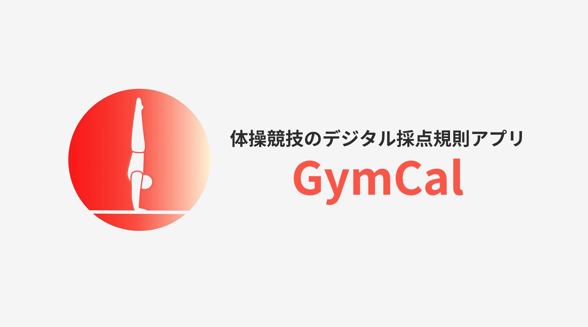

# ■ GymCal

体操競技のデジタル採点規則アプリ「GymCal」

## ■ アプリ URL

http://gymcal.jp

ログイン不要で全サービスを利用できます。

## ■ アプリを作ったきっかけ

数学の公式を文章で学ぶより、例題を解く方が理解が深まった経験はありませんか？

体操競技の複雑なルールが **「電卓のように自動計算」** されたらもっと体操競技を直感的に理解できるのではないかと考え、このアプリを開発しました。

電卓のように自動的に得点が計算される機能と、どのようなルールが適用されたかを表示する機能などで選手や指導者の負担を減らすだけでなく、 **組み合わせによって得点が変わる体操競技の面白さ** を表現することを目的としています。

## ■ イチオシ機能

| D スコア自動計算機能                                               |
| :----------------------------------------------------------------- |
|  |
| ユーザーが選んだ技に応じて D スコアを自動計算します。              |

その他の機能は[機能紹介](./docs/機能紹介.md)を参照してください。

## ■ 使用技術

| カテゴリ           | 技術スタック                                          |
| ------------------ | ----------------------------------------------------- |
| **フロントエンド** | HTML/CSS TypeScript(5.5.2) React(18.3.1)        |
| **バックエンド**   | PHP(8.3.10) Laravel(11.20.0) SQLite(3.43.2)     |
| **インフラ**       | AWS EC2 AWS Route53 Nginx(1.24.0) お名前.com |
| **開発ツール**     | GitHub SourceTree Visual Studio Code         |

## ■ 技術ドキュメント

| [コンポーネント設計](./docs/コンポーネント設計.md) | [システム構成図](./docs/システム構成図.md) |
| :------------------------------------------------- | :----------------------------------------- |
| Atomic Design の概念に基づいて設計しています。     | AWS EC2 にデプロイしています。             |

| [データベース定義](./docs/データベース定義.md)       | [API 定義](./docs/API定義.md)                 |
| :--------------------------------------------------- | :-------------------------------------------- |
| 体操競技の規則を Elements テーブルに定義しています。 | Elements テーブルの全データを提供しています。 |

## ■ 今後の課題と展望

現在はアカウント機能のない、まさに電卓のようなアプリになっています。

今後はアカウント機能や演技構成の保存機能を実装することで**他ユーザーの演技構成を簡単に共有できる**ようにする予定です。

また、UI/UX の向上のため以下の機能を検討しています。

- 技一覧ビューのピンチイン/アウト機能実装
- チュートリアルの作成
- 演技構成に対する DnD 導入
- 技検索機能実装
