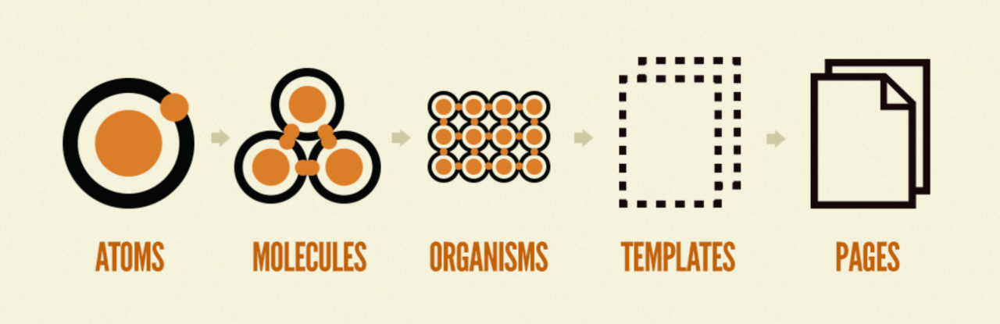
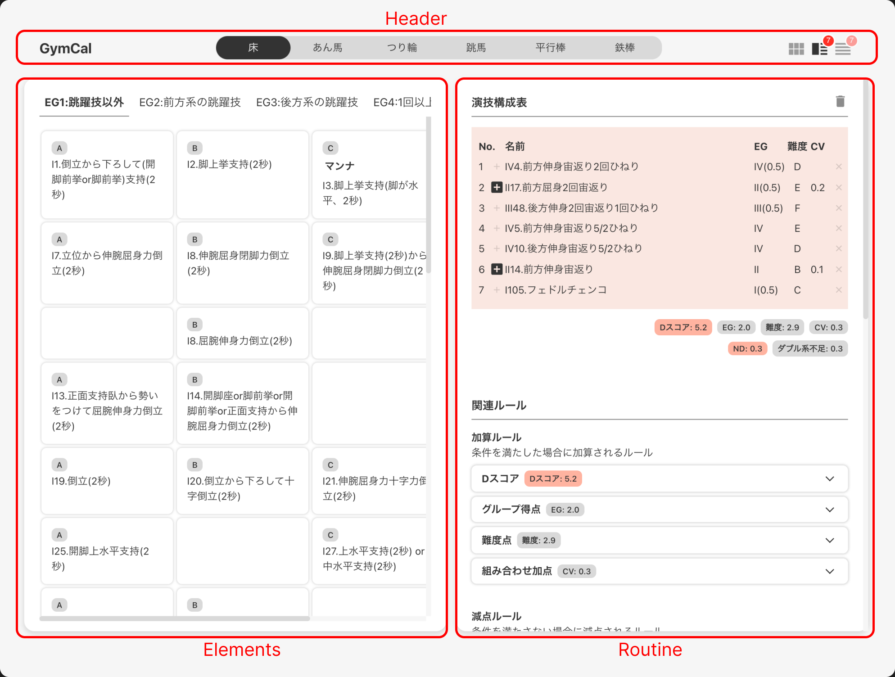
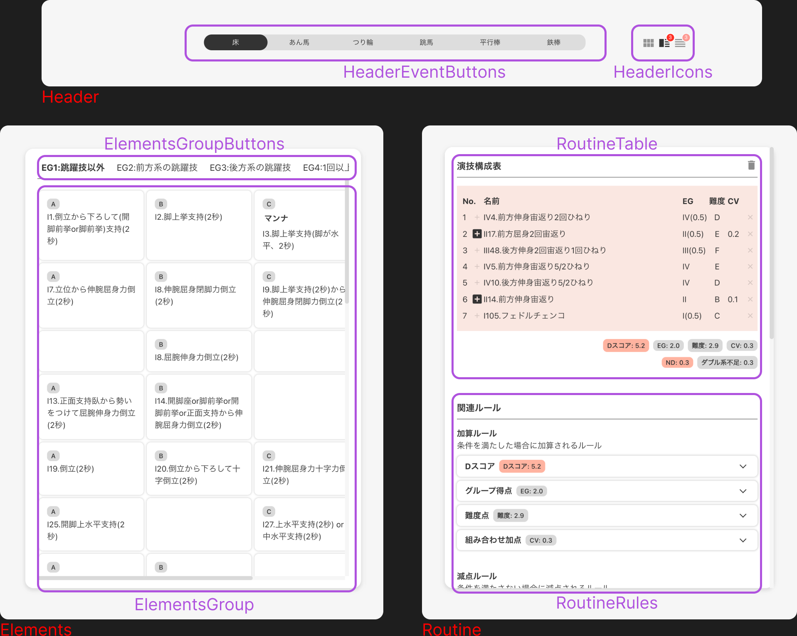
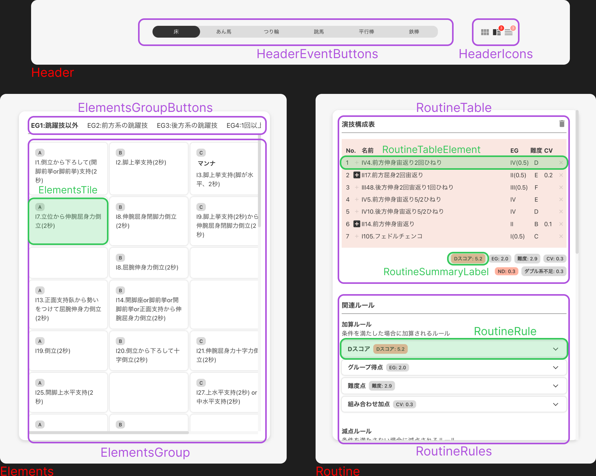

# ■ コンポーネント図

コンポーネントは **[Atomic Design](https://bradfrost.com/blog/post/atomic-web-design/)** の概念を参考にしました。

## 🟥 Organisms

複数の機能を持つ要素を Organisms(有機体)としました。

| コンポーネント名 | 提供機能                               |
| ---------------- | -------------------------------------- |
| Header           | 「種目変更」「画面モード切替」         |
| Elements         | 「技グループ選択」「技の表示」         |
| Routine          | 「演技構成表の表示」「関連ルール表示」 |

## 🟪 Molecules

単一の機能を持つ要素を Molecules(分子)としました。

| コンポーネント名     | 提供機能             |
| -------------------- | -------------------- |
| HeaderEventButtons   | 「種目変更」         |
| HeaderIcons          | 「画面モード切替」   |
| ElementsGroupButtons | 「技グループ選択」   |
| ElementsGroup        | 「技の表示」         |
| RoutineTable         | 「演技構成表の表示」 |
| RoutineRules         | 「関連ルール表示」   |

## 🟩 Atoms

最小単位の要素や UI パーツを を Atoms(原子)としました。

| コンポーネント名    | 提供要素                          |
| ------------------- | --------------------------------- |
| ElementsTile        | 技 1 つ分のタイル                 |
| RoutineTableElement | 演技構成表                        |
| RoutineSummaryLabel | スコア表示                        |
| RoutineRule         | 関連ルール 1 つ分のアコーディオン |

