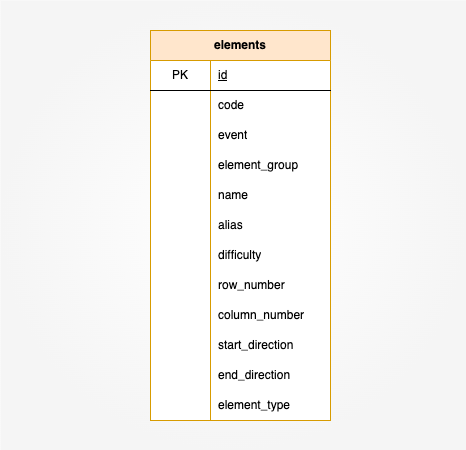

# ■ データベース定義

## ■ ER 図

体操競技の規則を **Elements テーブル** に定義しています。

1 つのレコードは 1 つの技に対応し、技の性質に関するプロパティを持ちます。

## ■ テーブル定義

| No. | 論理名     | 物理名            | データ型               | 備考                                                                               |
| --- | ---------- | ----------------- | ---------------------- | ---------------------------------------------------------------------------------- |
| 1   | ID         | `id`              | `unsignedSmallInteger` | 主キー                                                                             |
| 2   | コード     | `code`            | `string`               | 採点規則に記載されているグループ内の識別番号                                       |
| 3   | 種目       | `event`           | `unsignedTinyInteger`  | 1:床 2:あん馬 3:つり輪 4:跳馬 5:平行棒 6:鉄棒                                      |
| 4   | 技グループ | `element_group`   | `unsignedTinyInteger`  | 1:EG1 2:EG2 3:EG3 4:EG4  跳馬のみ 5:EG5 を含む                                  |
| 5   | 技の名前   | `name`            | `string`               |                                                                                    |
| 6   | 別名       | `alias`           | `string`               | 以下の場合に値が格納される。 1.選手名が付与されている場合 2.通称名がある場合 |
| 7   | 難易度     | `difficulty`      | `unsignedTinyInteger`  | A~J の 10 段階(1~10 で表す)                                                        |
| 8   | 行番号     | `row_number`      | `unsignedTinyInteger`  | 「難度表」の表示行を格納する。                                                     |
| 9   | 列番号     | `column_number`   | `unsignedTinyInteger`  | 「難度表」の表示列を格納する。                                                     |
| 10  | 開始方向   | `start_direction` | `unsignedTinyInteger`  | 組み合わせ可否判断に使用する。 [床]1:前方系 2:後方系 [鉄棒]1:順手系 2:逆手系 |
| 11  | 終了方向   | `end_direction`   | `unsignedTinyInteger`  | start_direction と 同様                                                            |
| 12  | 技タイプ   | `element_type`    | `string`               | 類似技の制限ルールに使用する。                                                     |

> すべてのプロパティは `Not Null` であり、デフォルトは `None` です。
