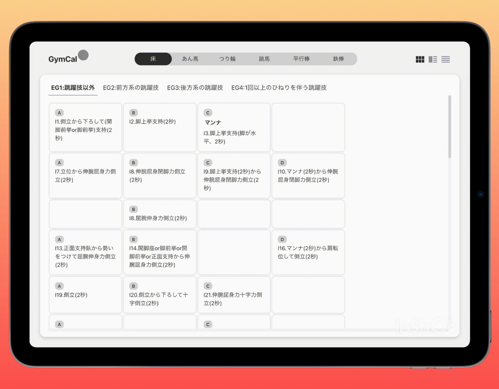
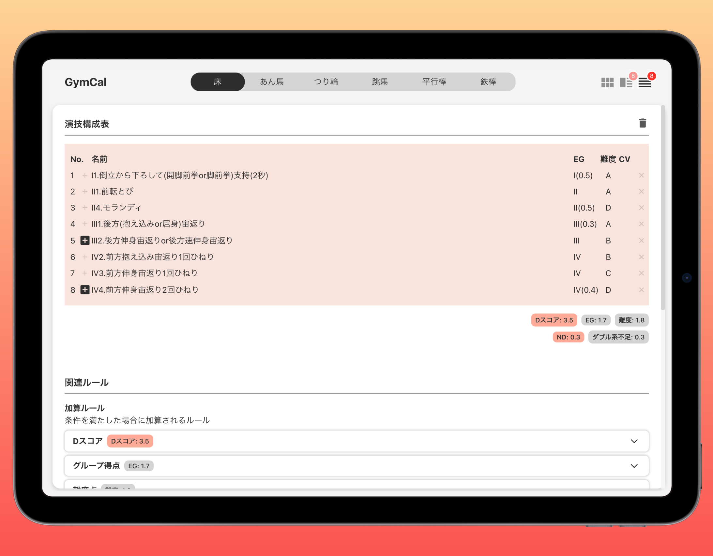
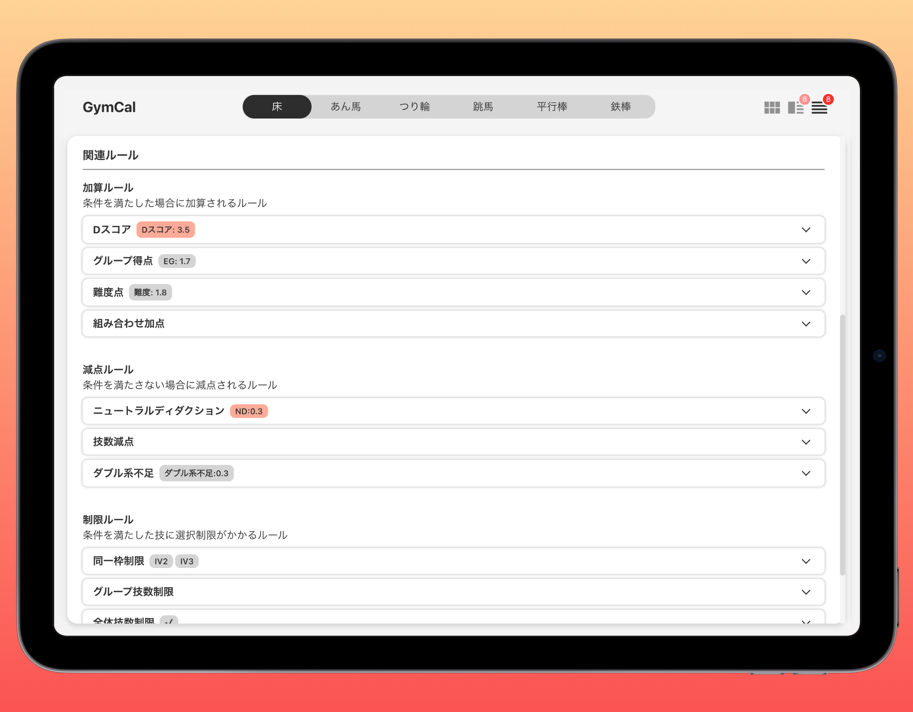
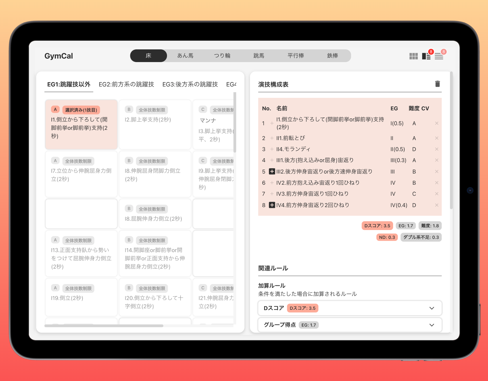

## ■ 機能紹介

| 種目変更機能[PC モード]                                   | 種目変更機能[SP モード]                                       |
| :-------------------------------------------------------- | :------------------------------------------------------------ |
|  |  |
| 男子体操競技の 6 種目から種目を選択できます。             | SP モードではドロップダウンリストに切り替わります。           |

| グループ変更機能                                                                   | 画面モード切替機能                                                                      |
| :--------------------------------------------------------------------------------- | :-------------------------------------------------------------------------------------- |
|                       |                        |
| グループを選択できます。 1 つの種目の技は特徴ごとにグループに分けられています。 | 表示する画面モードを切り替えます。 SP モードでは「分割画面モード」は表示できません。 |

| 難度表                                                                                                           | 演技構成表                                                                                             |
| :--------------------------------------------------------------------------------------------------------------- | :----------------------------------------------------------------------------------------------------- |
|                                                                     |                                                   |
| 技をタイル状に配置しています。 体操競技の採点規則を見慣れている人のために、採点規則と同じ見た目にしています。 | 選択された技を表示します。 得点の算出に関する技のプロパティ(技のグループや難易度)を表示しています。 |

| 関連ルール                                                                             | 関連ルール詳細                                                                                       |
| :------------------------------------------------------------------------------------- | :--------------------------------------------------------------------------------------------------- |
|                                   |                                         |
| ルールをリスト形式で表示しています。 ルールを性質(加算,減算,制限)で分類しています。 | ルールの詳細をアコーディオン形式で表示しています。 詳細説明にはルールの適用状態を表示しています。 |

| 分割画面                                                                                                                         |
| :------------------------------------------------------------------------------------------------------------------------------- |
|                                                                                 |
| 「難度表」と「演技構成表（関連ルール）」の画面を分割で表示しています。  分割画面は横幅の広い画面に対応しています(PC モード)。 |

## ■ GymCal に導入されている体操競技の規則一覧

D スコアの自動計算に使用しているルールは以下を参照してください。

| 体操競技の規則                         |
| ------------------------------------------ |
| [共通機能](/docs/機能/00_機能_共通.md)     |
| [床機能](/docs/機能/01_機能_床.md)         |
| [あん馬機能](/docs/機能/02_機能_あん馬.md) |
| [つり輪機能](/docs/機能/03_機能_つり輪.md) |
| [跳馬機能](/docs/機能/04_機能_跳馬.md)     |
| [平行棒機能](/docs/機能/05_機能_平行棒.md) |
| [鉄棒機能](/docs/機能/06_機能_鉄棒.md)     |
